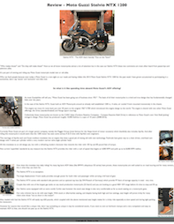

# Canada_Moto_Guide
CMG - Canada Moto Guide
Motorcycle Review

Technology Used: HTML and CSS

This is a prototype HTML webpage I coded using HTML and inline CSS.

It's a motorcycle review for a local motorcycle website called CMG Online and I tried as much as I could to style my page to match the stories laid out on their website.

I took and edited the photos as well as authored the review.

Gave me a chance to begin to use codeing skills and I think it is close to what they would have online.
Their Editor was impressed and told me they enjoyed my review.

